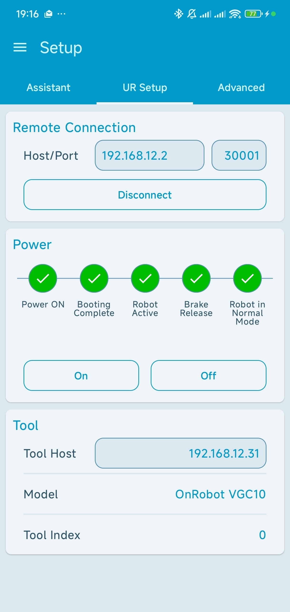
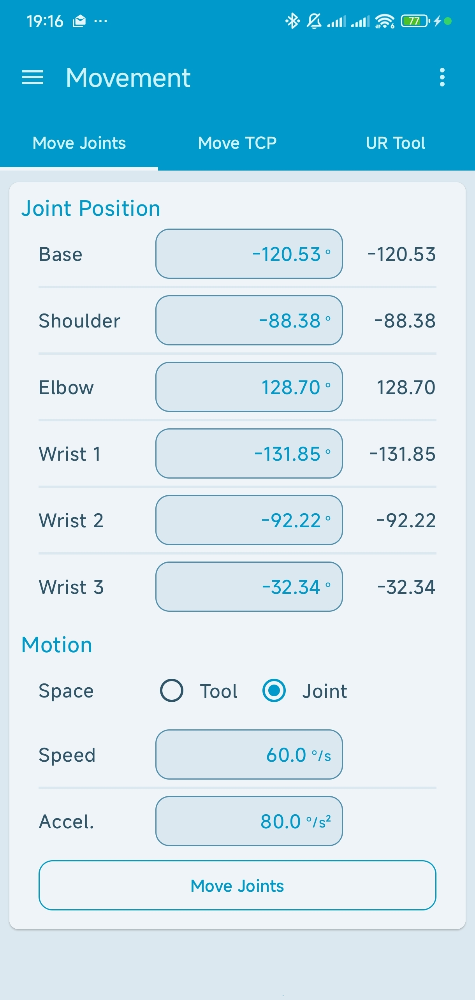
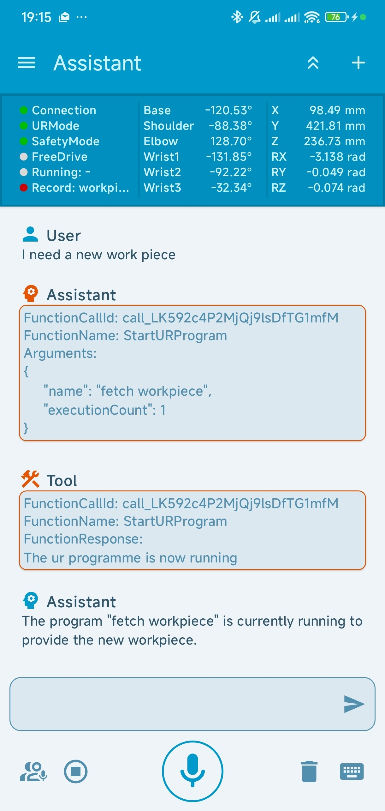
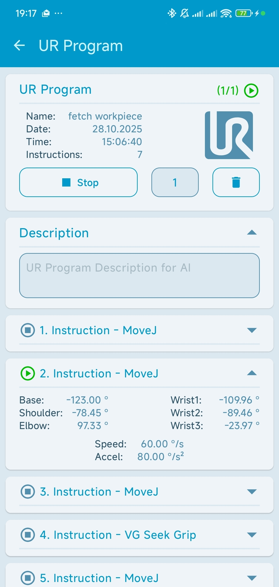

# Universal Robots API client for Kotlin

[](https://jitpack.io/#wolfscowl/ur-kotlin)
[](LICENSE.md)
[](https://wolfscowl.github.io/ur-test/)

A lightweight Kotlin API client for Universal Robots (Primary Interface and Dashboard Server) with coroutines support.

## 📦 Setup

### Gradle (Kotlin DSL)

Install the Universal Robots API client by adding the JitPack repository and the dependency to your `build.gradle` file:

```kotlin
repositories {
    mavenCentral()
    maven { url = uri("https://jitpack.io") }
}

dependencies {
    implementation("com.github.wolfscowl:ur-kotlin:1.0.1")
}
```

<details> <summary><b>Gradle (Groovy)</b></summary>
If you are using Groovy, add this to your build.gradle:

```groovy
repositories {
    mavenCentral()
    maven { url 'https://jitpack.io' }
}

dependencies {
    implementation 'com.github.wolfscowl:ur-kotlin:1.0.1'
}
```
</details>

### Maven

Install the Universal Robots API client by adding the JitPack repository and the dependency to your `pom.xml` file:

```xml
<repositories>
    <repository>
        <id>jitpack.io</id>
        <url>https://jitpack.io</url>
    </repository>
</repositories>

<dependency>
    <groupId>com.github.wolfscowl</groupId>
    <artifactId>ur-kotlin</artifactId>
    <version>1.0.1</version>
</dependency>
```

## ⚡️ Getting Started

The API distinguishes between Dashboard Server commands and commands sent via the Primary Interface.
- Primary Interface: Requires a persistent connection to receive Real-Time data or execute movement commands.
- Dashboard Commands: A short-lived connection is automatically established for each command.


Create an instance of the Universal Robots client by providing the robot's IP address:

```kotlin
val ur = UR(
    host = "192.168.2.1",
    // additional optional configurations...
)
```

Connect to the Primary Interface to receive real-time data and execute movement commands. 

```kotlin
try {
    ur.connect()
} catch (e: Exception) {
    println("Host is unavailable")
}
```

## 📚 Guides
Explore our detailed tutorials to master robot automation with Kotlin:

📖 [1. Dashboard Server - Remote Control & Program Management:](guides/dashboard-server-guide.md)
Learn how to interact with Polyscope, load installations, and automate program execution via the Dashboard Server.

📖 [2. Primary Interface - Real-Time Data & Monitoring:](guides/primary-interface-data-guide.md)
Learn how to read live data and monitor the robot's "Digital Twin" through the Primary Interface.

📖 [3. Primary Interface - Motion Control, Scripts & Procedures:](guides/primary-interface-procedures-guide.md)
Learn how to send movement commands and synchronize your code with the robot's physical actions using our state-driven procedure logic

📖 [4. Primary Interface: Operating OnRobot End-Effectors:](guides/primary-interface-gripper-guide.md)
Learn how to integrate OnRobot grippers tools into your automation workflows.


## 📡 Primary Interface

The Primary Interface allows you to send URScript commands to the controller and receive Real-Time Data (at 10Hz). 
The commands are divided into standard Universal Robots base commands and specialized implementations for OnRobot end-effectors.

### Base Commands

Standard motion and configuration commands for the robot arm:

- [movej](https://wolfscowl.github.io/ur-kotlin/ur-kotlin/com.wolfscowl.ur_client.interfaces.arm/-u-r-arm/movej.html)
- [movel](https://wolfscowl.github.io/ur-kotlin/ur-kotlin/com.wolfscowl.ur_client.interfaces.arm/-u-r-arm/movel.html)
- [movec](https://wolfscowl.github.io/ur-kotlin/ur-kotlin/com.wolfscowl.ur_client.interfaces.arm/-u-r-arm/movec.html)
- [runURScript](https://wolfscowl.github.io/ur-kotlin/ur-kotlin/com.wolfscowl.ur_client.core/-u-r-interface/run-u-r-script.html)
- [setTcpOffset](https://wolfscowl.github.io/ur-kotlin/ur-kotlin/com.wolfscowl.ur_client.interfaces.arm/-u-r-arm/set-tcp-offset.html)
- [setTargetPayload](https://wolfscowl.github.io/ur-kotlin/ur-kotlin/com.wolfscowl.ur_client.interfaces.arm/-u-r-arm/set-target-payload.html)
- [enterFreeDriveMode](https://wolfscowl.github.io/ur-kotlin/ur-kotlin/com.wolfscowl.ur_client.interfaces.arm/-u-r-arm/enter-free-drive-mode.html)
- [exitFreeDriveMode](https://wolfscowl.github.io/ur-kotlin/ur-kotlin/com.wolfscowl.ur_client.interfaces.arm/-u-r-arm/exit-free-drive-mode.html)

### End-Effector Commands

The following grippers are currently supported:

<table>
  <thead>
    <tr>
      <th align="left">OnRobot TFG</th>
      <th align="left">OnRobot RG</th>
      <th align="left">OnRobot VG</th>
    </tr>
  </thead>
  <tbody>
    <tr>
      <td valign="top">
        <a href="https://wolfscowl.github.io/ur-kotlin/ur-kotlin/com.wolfscowl.ur_client.interfaces.tool/-on-robot-t-f-g/grip-ext.html">gripExt</a><br>
        <a href="https://wolfscowl.github.io/ur-kotlin/ur-kotlin/com.wolfscowl.ur_client.interfaces.tool/-on-robot-t-f-g/grip-int.html">gripInt</a><br>
        <a href="https://wolfscowl.github.io/ur-kotlin/ur-kotlin/com.wolfscowl.ur_client.interfaces.tool/-on-robot-t-f-g/release-ext.html">releaseExt</a><br>
        <a href="https://wolfscowl.github.io/ur-kotlin/ur-kotlin/com.wolfscowl.ur_client.interfaces.tool/-on-robot-t-f-g/release-int.html">releaseInt</a>
      </td>
      <td valign="top">
        <a href="https://wolfscowl.github.io/ur-kotlin/ur-kotlin/com.wolfscowl.ur_client.interfaces.tool/-on-robot-r-g/grip.html">grip</a><br>
        <a href="https://wolfscowl.github.io/ur-kotlin/ur-kotlin/com.wolfscowl.ur_client.interfaces.tool/-on-robot-r-g/release.html">release</a>
      </td>
      <td valign="top">
        <a href="https://wolfscowl.github.io/ur-kotlin/ur-kotlin/com.wolfscowl.ur_client.interfaces.tool/-on-robot-v-g/grip.html">grip</a><br>
        <a href="https://wolfscowl.github.io/ur-kotlin/ur-kotlin/com.wolfscowl.ur_client.interfaces.tool/-on-robot-v-g/release.html">release</a><br>
        <a href="https://wolfscowl.github.io/ur-kotlin/ur-kotlin/com.wolfscowl.ur_client.interfaces.tool/-on-robot-v-g/seek-grip.html">seekGrip</a>
      </td>
    </tr>
  </tbody>
</table>

### Real-Time Data

The client continuously updates robot state variables and provides them as both standard properties and Kotlin Coroutine Flows.
For a comprehensive list of available data fields (e.g., Joint Positions, TCP Poses, Currents), please refer to the [Universal Robots Primary Interface Documentation](https://github.com/wolfscowl/ur-kotlin/blob/main/guides/pdf/ur/ClientInterfaces_Primary_Secondary.pdf).


## 🖥️ Dashboard Server

The following commands are currently supported via the Dashboard Server. 
For a detailed description of each function, please refer to the [API Documentation](https://wolfscowl.github.io/ur-kotlin/ur-kotlin/com.wolfscowl.ur_client.core/-u-r-dash-board/index.html) 
and [Dashboard Server Documentation](https://github.com/wolfscowl/ur-kotlin/blob/main/guides/pdf/ur/DashboardServer_e-Series_2022.pdf) from Universal Robots.

- [powerOn](https://wolfscowl.github.io/ur-kotlin/ur-kotlin/com.wolfscowl.ur_client.core/-u-r-dash-board/power-on.html)
- [powerOff](https://wolfscowl.github.io/ur-kotlin/ur-kotlin/com.wolfscowl.ur_client.core/-u-r-dash-board/power-off.html)
- [shutdown](https://wolfscowl.github.io/ur-kotlin/ur-kotlin/com.wolfscowl.ur_client.core/-u-r-dash-board/shutdown.html)
- [loadInstallation](https://wolfscowl.github.io/ur-kotlin/ur-kotlin/com.wolfscowl.ur_client.core/-u-r-dash-board/load-installation.html)
- [load](https://wolfscowl.github.io/ur-kotlin/ur-kotlin/com.wolfscowl.ur_client.core/-u-r-dash-board/load.html)
- [play](https://wolfscowl.github.io/ur-kotlin/ur-kotlin/com.wolfscowl.ur_client.core/-u-r-dash-board/play.html)
- [stop](https://wolfscowl.github.io/ur-kotlin/ur-kotlin/com.wolfscowl.ur_client.core/-u-r-dash-board/stop.html)
- [pause](https://wolfscowl.github.io/ur-kotlin/ur-kotlin/com.wolfscowl.ur_client.core/-u-r-dash-board/pause.html)
- [unlockProtectiveStop](https://wolfscowl.github.io/ur-kotlin/ur-kotlin/com.wolfscowl.ur_client.core/-u-r-dash-board/unlock-protective-stop.html)
- [fetchRobotModel](https://wolfscowl.github.io/ur-kotlin/ur-kotlin/com.wolfscowl.ur_client.core/-u-r-dash-board/fetch-robot-model.html)
- [fetchRobotMode](https://wolfscowl.github.io/ur-kotlin/ur-kotlin/com.wolfscowl.ur_client.core/-u-r-dash-board/fetch-robot-mode.html)
- [fetchSafetyStatus](https://wolfscowl.github.io/ur-kotlin/ur-kotlin/com.wolfscowl.ur_client.core/-u-r-dash-board/fetch-safety-status.html)
- [fetchSerialNumber](https://wolfscowl.github.io/ur-kotlin/ur-kotlin/com.wolfscowl.ur_client.core/-u-r-dash-board/fetch-serial-number.html)
- [fetchPolyscopeVersion](https://wolfscowl.github.io/ur-kotlin/ur-kotlin/com.wolfscowl.ur_client.core/-u-r-dash-board/fetch-polyscope-version.html)
- [fetchIsRunning](https://wolfscowl.github.io/ur-kotlin/ur-kotlin/com.wolfscowl.ur_client.core/-u-r-dash-board/fetch-is-running.html)
- [fetchProgramState](https://wolfscowl.github.io/ur-kotlin/ur-kotlin/com.wolfscowl.ur_client.core/-u-r-dash-board/fetch-program-state.html)
- [fetchLoadedProgram](https://wolfscowl.github.io/ur-kotlin/ur-kotlin/com.wolfscowl.ur_client.core/-u-r-dash-board/fetch-loaded-program.html)

## 📄 License

UR Kotlin API Client is an open-sourced software licensed under the [MIT license](LICENSE.md).
This is an unofficial library, it is not affiliated with nor endorsed by Universal Robots.

## 📱 Showcase: Vocobo (Context-Aware Voice Control)

I originally developed this library as the communication backbone for **Vocobo** — 
a LLM driven mobile assistance system that enables **Programming by Natural Language (PNL)** 
for Universal Robots.

I built this library because no Kotlin or Java library existed that allowed for seamless, 
native communication with UR Cobots. Vocobo demonstrates what is possible with this 
library: it bridges the "interface gap" by allowing operators to program and control 
the robot arm entirely through voice and touch.


### How Vocobo leverages this Library:

- **High-Level Control:** Using the Dashboard Server (Guide 1), Vocobo manages the robot's operational state—such as powering on and releasing brakes—directly from a smartphone.

- **Real-Time Telemetry:** Through the Digital Twin (Guide 2), Vocobo constantly monitors the robot's status. This enables context-sensitive commands like "Lift the arm a bit higher," as the app is always aware of the current position.

- **Synchronized Workflows:** Complex tasks like "Pick-and-Place" are executed via Procedures (Guide 3/4). Vocobo utilizes the library's state-driven design to detect exactly when a motion sequence is completed or if an error has occurred.

- **Hands-on Programming:**  The library enables a fluid workflow where a single operator can guide the robot in Free-Drive (Guide 3) and save waypoints via voice commands simultaneously, eliminating the need to go back and forth to a stationary Teach-Pendant.

### 📸 App Impressions


<table border="0px" width="100%" cellpadding="0" cellspacing="0">
  <tr>
<td align="center" width="50%">
      <br />
      <em>Dashboard: Remote state control</em>
    </td>
<td align="center" width="50%">
      <br />
      <em>Manual Control via Touch</em>
    </td>
  </tr>
  <tr>
<td align="center" width="50%">
      <br />
      <em>Voice interaction & LLM logic</em>
    </td>
<td align="center" width="50%">
      <br />
      <em>Visualized instruction sequence</em>
    </td>
  </tr>
</table>